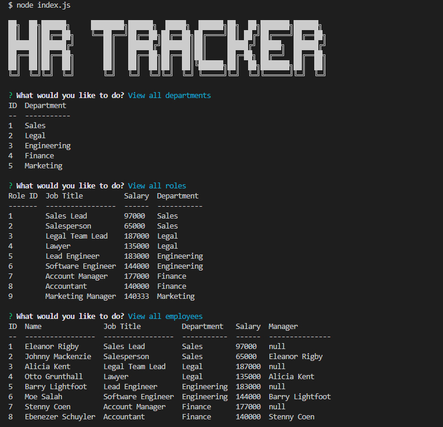

#  Module 12 : HR Tracker

## Overview

I have created a CLI based employee tracker that allows HR to check employee's information from databases as well as add and edit information such as employees, or their roles.

## Installation

NodeJS and a command line application will be needed to use the product.

## Usage

The application is run by executing <node index.js> in the CLI when in the appropriate directory.
Once started, the user will be presented with a list of options as to how to proceed. The user can view a selection of tables, or add to/edit them as needed. After every task is completed, the updated table is presented, and the main menu returns.

### Links

 [Github Repo](https://github.com/sashdc/hr-tracker)
 
 [Walkthrough Video](https://drive.google.com/file/d/13uRr5rhECB3i4q0DHX2-naE-lwqJImal/view)

 ## Credits

Cherian, Saharsh

[Creator Github](https://github.com/sashdc)

## License

N/A